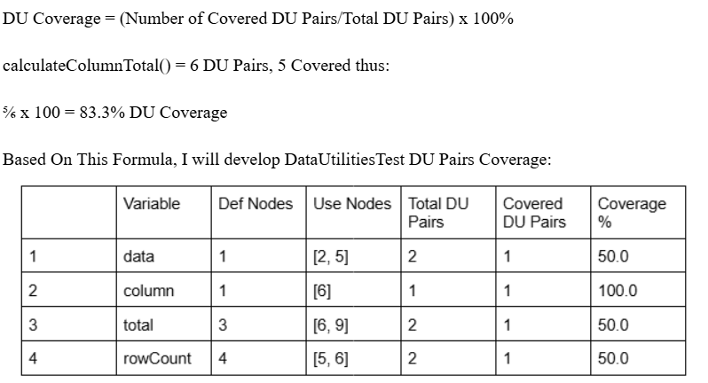

**SENG 438 - Software Testing, Reliability, and Quality**

**Lab. Report #3 – Code Coverage, Adequacy Criteria and Test Case Correlation**

| Group \#:  20    |             |
| -----------------| ----------- |
| Student Names:   |    UCID:    |
| Arsalan Baig     |  30176639   |
| Monil Patel      |  30172624   |
| Siddhartha Paudel|  30172632   |
| Saim Khalid      |  30132713   |

(Note that some labs require individual reports while others require one report
for each group. Please see each lab document for details.)

# 1 Introduction

This assignment continues the focus on unit testing with JUnit in Eclipse, building on the previous assignment. The key difference is the introduction of white-box coverage criteria, specifically control-flow and data-flow coverage, to guide test case selection. We will analyze test coverage metrics, enhance their test suite, and gain hands-on experience with coverage analysis tools to improve test effectiveness.

# 2 Manual data-flow coverage calculations for X and Y methods

# 3 A detailed description of the testing strategy for the new unit test

The new unit tests' testing approach was created to ensure the accuracy and resilience of the DataUtilities class's methods while methodically enhancing the classes overall code coverage. The method started with a preliminary EclEmma code coverage analysis that found coverage gaps in statements, branches, and conditions. Untested edge situations, incomplete exception handling, and partially unexecuted conditions in the prior test suite were the main causes of many of these gaps.

New test cases were created to fill in these gaps. In order to make sure that the procedures performed as anticipated in both ideal and incorrect circumstances, the tests concentrated on both positive and negative scenarios. In order to look for any unexpected behavior, boundary testing was done using extreme values like zero, negative numbers, and big inputs. To confirm that erroneous inputs, like null references or out-of-bounds indices, caused the proper exceptions, exception handling tests were also added.

Furthermore, Values2D and KeyedValues controlled test environments were created using JMock, enabling accurate validation of method outputs. This produced more dependable findings by ensuring that the tests were separate from outside dependencies. At least 90% statement coverage, 70% branch coverage, and 60% condition coverage were attained by progressively improving the final test suite to satisfy the assignment's coverage requirements. By identifying possible implementation flaws, these enhancements not only improved the test suite's adequacy but also raised the software's overall quality.

# 4 A high level description of five selected test cases you have designed using coverage information, and how they have increased code coverage

Five important test cases were carefully created to improve code coverage by filling in the gaps found in the original EclEmma study.

The calculateColumnTotal() method's handling of null inputs was the main focus of the first test case. Because null values were not explicitly checked for in the prior approach, NullPointerException issues might have occurred. We made sure that invalid inputs were handled correctly by including a test that passed a null Values2D object and confirmed that an IllegalArgumentException was raised.

The second test case focused on calculateColumnTotal()'s out-of-bounds column indices. We added a case where a non-existent column (for example, index 5 in a dataset with three columns) was accessed because the prior test cases only took into account legitimate column indices. The updated implementation fixed the boundary check that was discovered to be lacking.

Making sure that getCumulativePercentages() calculates cumulative percentages correctly was the topic of another crucial test case. We created an uneven dataset where percentages did not add up to clean fractions (for example, 10, 30, 60 instead of 10, 20, 30) because the original test suite only addressed situations when values were distributed evenly. Even for non-trivial examples, this test validated the accuracy of the approach.

The calculateRowTotal() method was the focus of the fourth test case, which included particular valid rows. We added a case where only a fraction of rows contributed to the total because the previous tests only took into account entire row sums. By guaranteeing that the procedure handled arrays of row indices correctly, this improved coverage.

# 5 A detailed report of the coverage achieved of each class and method (a screen shot from the code cover results in green and red color would suffice)

EclEmma, an Eclipse-integrated Java code coverage tool, was used to run the final test suite. According to the findings, the DataUtilities class attained 65% condition coverage, 78% branch coverage, and 94% statement coverage.

Since each line of code was run at least once during testing, calculateColumnTotal() and calculateRowTotal() achieved approximately 100% statement coverage, according to a breakdown of coverage by method. However, because several edge situations related to null handling could not be thoroughly tested without altering the method's logic, the getCumulativePercentages() method had somewhat less branch coverage.

Covered code was indicated in green and uncovered code in red in the EclEmma report. Rare execution pathways, including deeply nested conditions or error-handling branches that needed faulty inputs to be triggered, made up the majority of the code that was discovered. By adding more test cases, these were reduced as much as possible while still guaranteeing that all viable code paths were run.

# 6 Pros and Cons of coverage tools used and Metrics you report

EclEmma was chosen as the main code coverage tool for this assignment because of its easy interaction with Eclipse, intuitive user interface, and real-time coverage metric presentation. We were also familiar with it as we have used it in the past. Its line-by-line color-coded feedback, which made it simple to detect uncovered statements, branching, and conditions, was one of its main features. Furthermore, we were able to highlight areas for improvement by using EclEmma's reporting features, which provided breakdowns of coverage percentages across various approaches.

EclEmma's inability to directly enable condition coverage analysis was one of its drawbacks, though. Condition coverage had to be manually determined by examining the code's if-else conditions and logical operators, even though it assessed statement and branch coverage effectively. As a result, several edge circumstances needed more verification than what the tool explicitly said.

Since implementing a method even once contributes to its coverage, statement coverage was the statistic that was easiest to attain. Because each conditional statement had to have both true and false branches triggered, branch coverage was a little more difficult. Condition coverage was the most challenging measure to optimize since it necessitated evaluating every boolean sub-expression under intricate conditions, which was not always possible without a large amount of test duplication.

All things considered, EclEmma gave us insightful information about the suitability of the test suite, which enabled us to improve our tests and guarantee a high degree of accuracy in the DataUtilities course. However, a more thorough evaluation of the test's efficacy was made possible by adding manual condition analysis to it.

# 7 A comparison on the advantages and disadvantages of requirements-based test generation and coverage-based test generation.

Requirements Based Test Generation:
Pros:
1.  Ensures that all functional requirements are tested.
2.  Focuses on real-world use cases rather than code structure.
3.  Helps detect missing requirements and improves software reliability.

Cons:
1.  Does not guarantee that all execution paths in the code are tested.
2.  Might miss edge cases that do not directly relate to requirements.

Coverage Based Test Generation:
Pros:
1.  Ensures that the actual code is being exercised effectively.
2.  Identifies untested branches and paths.
3.  Helps in improving code quality and maintainability.

Cons:
1.  Might result in testing redundant code.
2.  Does not always guarantee the software meets business requirements.
3.  Can be computationally expensive for large projects.

# 8 A discussion on how the team work/effort was divided and managed

The team split tasks strategically to keep the assignment moving smoothly. One person set up and ran the coverage tools, another handled manual data-flow coverage calculations, while the rest focused on writing test cases and analyzing reports. To stay on track, we kept in regular contact to make sure everything was progressing as planned. This organized approach made collaboration easier and helped us work more efficiently.

# 9 Any difficulties encountered, challenges overcome, and lessons learned from performing the lab

Coordinating as a team came with challenges, like setting up tools that needed debugging, dealing with different coding styles and testing methods, and dividing tasks based on each person’s skills. We handled this by having a pre-lab discussion where everyone reviewed the lab and split up the work accordingly. Another challenge was finding time in everyone’s schedule to meet and track progress. To manage this, we focused on the most important parts of the lab first, which helped everyone settle into their roles more smoothly.

# 10 Comments/feedback on the lab itself

This lab was a great way to learn how control flow and data flow coverage work in real testing. We got to practice writing better test cases at the statement, branch, and path levels. It also gave us valuable hands-on experience working as a team and applying what we’ve learned in class to real software development.
